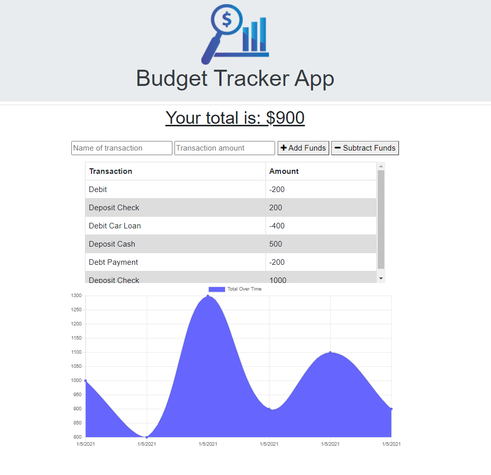
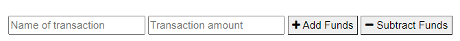
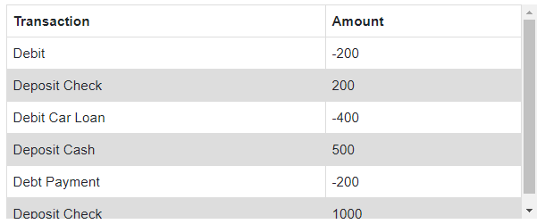
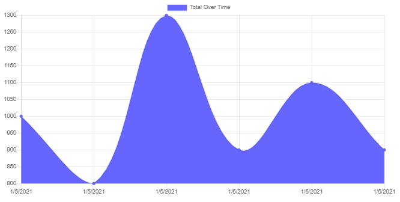

# Online-Offline-Budget-Trackers



[App Live on Heroku](https://glacial-wildwood-83860.herokuapp.com/)

---

### Table of Contents

- [Description](#description)
- [How to Use](#how-to-use)
- [Screenshots](#screenshots)
- [References](#references)
- [License](#license)
- [Author Info](#author-info)

---

## Description

The goal of this app is to create a Online/Offline Budget Tracker. This app will require to create Mongo database with a Mongoose schema and handle route with Express. The user will be able to add expenses and deposits to their budget with or without a connection. When entering transactions offline, they should populate the total when brought back online.

#### Technologies

- JavaScript
- NPM Modules
- Visual Studio Code
- Node.js
- Package.json
- Mongodb
- Express
- Mongoose
- Service Workers

##### Code sample - JavaScript - Connection to a Databse 
#

```js
const express = require("express");
const logger = require("morgan");
const mongoose = require("mongoose");
const compression = require("compression");

const PORT = process.env.PORT || 3000;

const app = express();

app.use(logger("dev"));

app.use(compression());
app.use(express.urlencoded({ extended: true }));
app.use(express.json());

app.use(express.static("public"));

mongoose.connect(process.env.MONGODB_URI || "mongodb://localhost/budget", {
  useNewUrlParser: true,
  useUnifiedTopology: true,
  useCreateIndex: true,
  useFindAndModify: false
});

// routes
app.use(require("./routes/api.js"));

app.listen(PORT, () => {
  console.log(`App running on port ${PORT}!`);
});

```
##### Code sample - service-worker.js
#
```js
 const FILES_TO_CACHE = [
    "/",
    "/db.js",
    "/index.html",
    "/styles.css",
    "/index.js",
    "/manifest.webmanifest",
    "/icons/icon-192x192.png",
    "/icons/icon-512x512.png",
    "https://stackpath.bootstrapcdn.com/bootstrap/4.1.3/css/bootstrap.min.css",
    "/assets/Budget.png",
  ];
  
  const CACHE_NAME = "static-cache-v2";
  const DATA_CACHE_NAME = "data-cache-v1";
  
  // install
  self.addEventListener("install", function(evt) {
    evt.waitUntil(
      caches.open(CACHE_NAME).then(cache => {
        console.log("Your files were pre-cached successfully!");
        return cache.addAll(FILES_TO_CACHE);
      })
    );
  
    self.skipWaiting();
  });
  
  self.addEventListener("activate", function(evt) {
    evt.waitUntil(
      caches.keys().then(keyList => {
        return Promise.all(
          keyList.map(key => {
            if (key !== CACHE_NAME && key !== DATA_CACHE_NAME) {
              console.log("Removing old cache data", key);
              return caches.delete(key);
            }
          })
        );
      })
    );
  
    self.clients.claim();
  });

```

##### Code sample - javaScript - Functions to interact with the Database using a model file
#
```js
const mongoose = require("mongoose");

const Schema = mongoose.Schema;

const transactionSchema = new Schema(
  {
    name: {
      type: String,
      trim: true,
      required: "Enter a name for transaction"
    },
    value: {
      type: Number,
      required: "Enter an amount"
    },
    date: {
      type: Date,
      default: Date.now
    }
  }
);

const Transaction = mongoose.model("Transaction", transactionSchema);

module.exports = Transaction;

```
---
## How To Use

This application is running on a webpage deployed on Heroku. When the user loads the page, they should be given the option to input a withdrawal or deposit, then that will be shown on the page, and added to their transaction history when their connection is back online.

The user should be able to:

  Offline Functionality:

  * Enter deposits offline

  * Enter expenses offline

When brought back online:

  * Offline entries should be added to tracker.


[Back To The Top](#Online-Offline-Budget-Trackers)
 
## Screenshots

- Inputs and Buttons. 



- Transactions Table. 



- Transactions Chart.




[Back To The Top](#Online-Offline-Budget-Trackers)

---

## References

- w3school -- [Node.js NPM](https://www.w3schools.com/nodejs/nodejs_npm.asp)
- NPM -- [Node Package Managment](https://www.npmjs.com/)
- Service Workers -- [Using Service Workers](https://developer.mozilla.org/en-US/docs/Web/API/Service_Worker_API/Using_Service_Workers)
- Node.js -- [About Node.js](https://nodejs.org/en/)
- json -- [The package.json guide](https://nodejs.dev/learn/the-package-json-guide)
- Mongodb -- [Mongodb](https://docs.mongodb.com/manual/reference/resource-document/)
- Express -- [express module](https://www.npmjs.com/package/express)


[Back To The Top](#Online-Offline-Budget-Trackers)

---

## License

Copyright (c) [2020] [Cesar A Martinez]

[Back To The Top](#Online-Offline-Budget-Trackers)

---

## Author Info

- Twitter -- [@cesaguma](https://twitter.com/cesaguma)
- Linkedin -- [Cesar A Martinez](https://www.linkedin.com/in/cesar-augusto-martinez-auquilla-03934a16b/)
- GitHub -- [CesarAugustoMartinez](https://github.com/CesarAugustoMartinez)

[Back To The Top](#Workout-Tracker)
